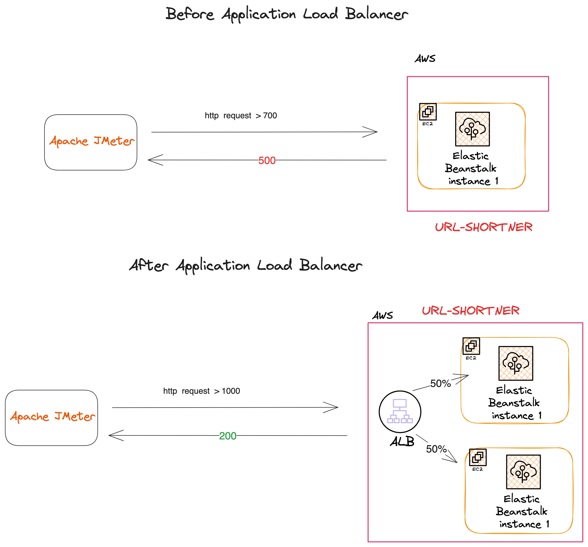

# Application Load Balancer for an Elastic Beanstalk Environment

***This repository guides you through a scenario where [a URL Shortener](https://github.com/elmorenox/jenkins-flaskapp-on-ec2-in-vpc), a Flask application running on a gunicorn server and proxied by NGINX, is expected to handle significant traffic spikes during the 12 government-recognized holidays in the US.***

## Story

The URL Shortener can currently handle up to 700 requests per second on a single T.2 micro. However, during the holidays, it is anticipated to receive between 900 - 1,000 requests per second. This guide will help infrastructure engineers to strategically scale compute and memory resources to accommodate these unexpected traffic spikes.

## Resolution

Create an Elastic Beanstalk environment with an Application Load Balancer and an Auto Scaling Group. The Auto Scaling Group will be configured to scale out based on a request threshold of 700. The Application Load Balancer will be configured to distribute traffic evenly across the EC2 instances.

Steps:
- Navigate to the Elastic Beanstalk console and click on "Create New Application". Give the application a name and click on "Create".
- Select "Web server environment" and click on "Select".
- Select "Python" as the platform and "Python 3.9" as the platform branch. Click on "Next".
- Select "Upload your code" and upload the zip file of the URL Shortener. Click on "Next".
- Select "Single instance" and click on "Next"
- In "Configure service access", select or create a role that can service Elastic Beanstalk
- Chose or create a role that can manage EC2 instances. Click on "Next".
- Select a VPC and 2 public subnets. Click on "Next".
- Activate the Public IP. Click on "Next".
- Select a "General Purpose SSD" volume type and 10 GB of storage.
- Set the Cloud Monitoring Interval to 1 minute.
- In the "Auto Scaling group" under Environment Type, select "Load balanced".
- Increase the "Maximum instances" to 2.
- Select a T2 micro instance type.
- Change the Scheduling Trigger to "Request count".
- Change Statistic to "Sum".
- Change Unit to "Count".
- Change Period to "1 Minute".
- Change the Lower Threshold to "600". Click on "Next".
- Create the environment.

In order to avoid dropped requests while the new instance is being provisioned, a Schedule Rule should be implemented for each holiday.

- On the navigation pane, under AUTO SCALING, choose Auto Scaling Groups.
- Select your Auto Scaling group.
- Choose the Scheduled Actions tab.
- Choose Create Scheduled Action.
- For Scheduled action name, type a name for the scheduled action.
- For Start time, type the date and time for the action to start.

